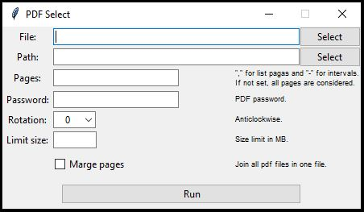

 

PDF Select
=========
Select pages, split big pdf files, merge pdf files... do that for a single file or multiple files in a path. 

Installation
============
Just download the file `pdf_select.pyw` and run it.

Dependencies
============
This script needs Python 3.6 (or more recent) default instalation and PyPDF2 module, but don't worry. The script will try to install PyPDF2 if this module is not available. If the script can't install PyPDF2, you can try to download [PyPDF2-1.26.0-py2.py3-none-any.whl](/PyPDF2-1.26.0-py2.py3-none-any.whl) and put it in the same location as the `pdf_select.pyw`.
